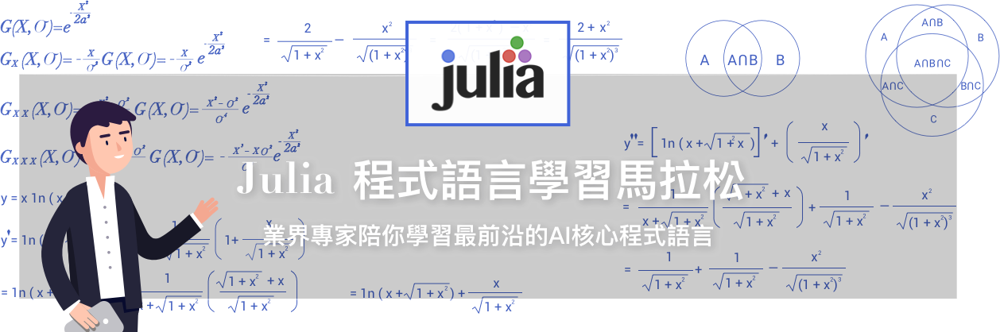

# :runner: 1st-DL-CVMarathon

Personal uploading space for the [1st-Julia-DL-CV-Marathon](https://julia.cupoy.com/), which is a marathon of training your web crawling skill.

### :trophy: [Certificate] Coming soon ... <!-- https://github.com/magikerwin1993/1st-PyCrawlerMarathon/blob/master/Certificate.pdf -->

## :triangular_flag_on_post: Introduction
- [Day 001](https://github.com/magikerwin1993/1st-DL-CVMarathon/tree/master/homework/Day-001) : Install & Setup [Julia](https://en.wikipedia.org/wiki/Julia_(programming_language))
- [Day 002](https://github.com/magikerwin1993/1st-DL-CVMarathon/tree/master/homework/Day-002) : [Markdown](https://en.wikipedia.org/wiki/Markdown) & [LaTex](https://en.wikibooks.org/wiki/LaTeX)
- [Day 003](https://github.com/magikerwin1993/1st-DL-CVMarathon/tree/master/homework/Day-003) : Package Management
- [Day 004](https://github.com/magikerwin1993/1st-DL-CVMarathon/tree/master/homework/Day-004) : Number System
- [Day 005](https://github.com/magikerwin1993/1st-DL-CVMarathon/tree/master/homework/Day-005) : Variables, Operators
- [Day 006](https://github.com/magikerwin1993/1st-DL-CVMarathon/tree/master/homework/Day-006) : Functions
- [Day 007](https://github.com/magikerwin1993/1st-DL-CVMarathon/tree/master/homework/Day-007) : Control Flow
- [Day 008](https://github.com/magikerwin1993/1st-DL-CVMarathon/tree/master/homework/Day-008) : Char & String
- [Day 009](https://github.com/magikerwin1993/1st-DL-CVMarathon/tree/master/homework/Day-009) : Arrays
- [Day 010](https://github.com/magikerwin1993/1st-DL-CVMarathon/tree/master/homework/Day-010) : Tuples, Pair, Dictionaries and Set
- [Day 011](https://github.com/magikerwin1993/1st-DL-CVMarathon/tree/master/homework/Day-011) : Date & DateTime