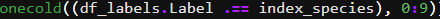
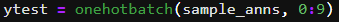
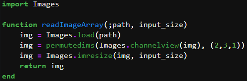
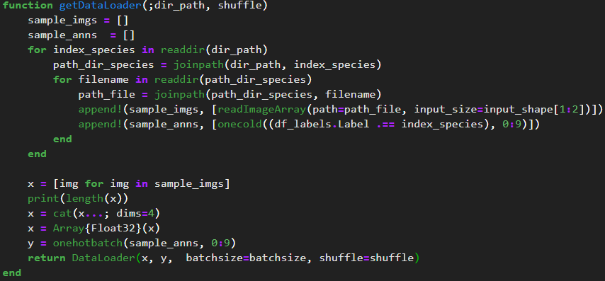
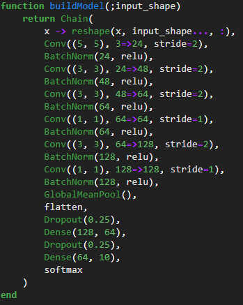
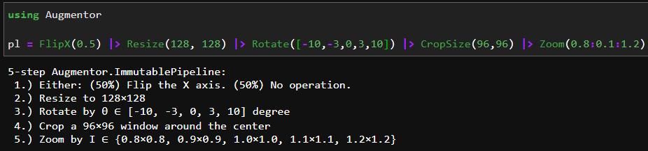
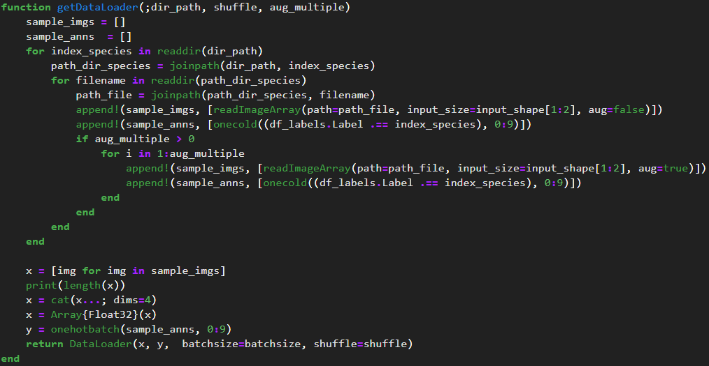
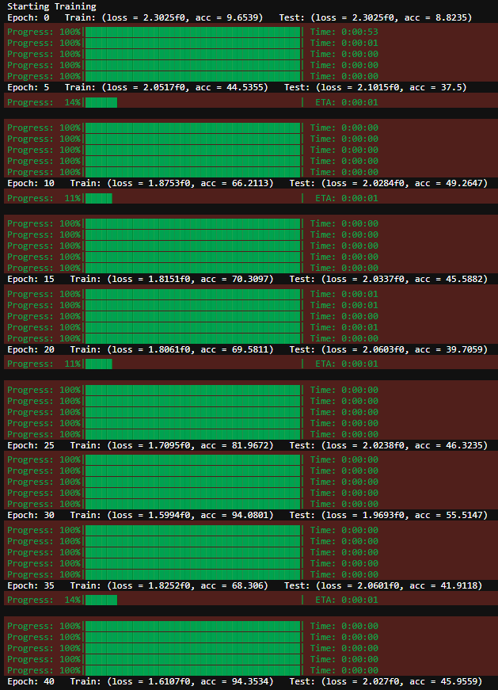
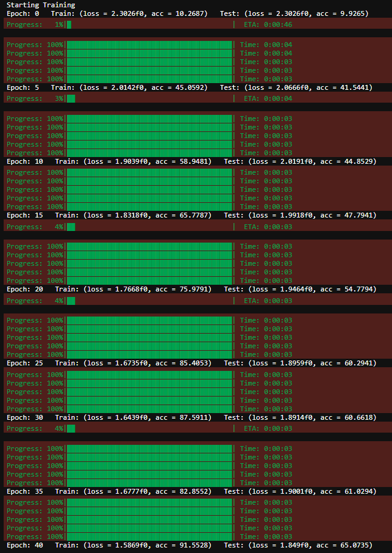

# 一、專題摘要

本次專題題目為"10種猴子辨識" (猴子版本的MNIST🤣)，目標是利用現有資料集訓練神經網路模型，使模型能順利分辨測試集中的猴子種類。進階目標是正確率達到95%以上。

# 二、實作方法介紹

## 1. GPU 加速

關於Day-033作業中使用cuda加速模型訓練，執行訓練時一直會報錯，不斷地更換各package/Julia版本後仍無解決問題，直到看到JJLai的期末專題文章，我參考FluxML官方的LeNet程式範例後，終於能順利使用cuda，這是我修改後的Day-033作業，本次專題也會參照同樣的方法訓練模型。

## 2. 讀入猴子資料集

### a. 讀入樣本標籤

(個人覺得此方法有點繞，也許有更好的方法來做onehot-labels)

先將資料集隨附的labels資訊整理成dataframe格式

將label string 轉成對應的index，例如: (“n0” >> 0), (“n7” >> 7)

再將index轉成onehot形式

### b. 讀入樣本影像

利用Images.jl提供的相關函式，讀入本地.jpg圖檔

(要注意調整資料格式 [Channel, Heigh ,Width] >> [Heigh ,Width,Channel])

可以利用下方程式碼，在jupyter notebook/lab中查看讀入影像

### c. 建立data loader

## 3. 建立模型

從初期的訓練結果中，發現模型在training data上有高正確率，但在testting dataset上正確率偏低，為了來避免模型overfitting，除了加入L2 Regularization與Dropout...等常見技巧，也嘗試減少整體網路的參數量，選用GlobalMeanPool來減少輸出端Dense層所需的參數量。

此外，有加入BatchNorm來加速網路訓練，且增加模型對feature noise的抗性。有考慮是否加入Residual Connection，但有鑒於資料集不大，估計所需模型層數不超過15層，應該不用特別避免梯度傳遞問題，故最終決定不使用。

## 4. loss function與優化設定

選用Adam優化器來實作，loss function 與先前Day-033作業無太大差異，故不贅述。

## 5. data augmentation

使用現有的Augmentor.jl 套件來進行data augmentation，採用random flipping/ rotation/ room-in/ cropping。

整理至剛剛data loader的建立函式中，"aug_multiple"代表擴增倍數，專案中的"aug_multiple"設定為3

# 三、成果展示

## 1. without data augmentation 

(trainning acc: 94.35%, testing acc: 45.95%)

## 2. with data augmentation 

(trainning acc: 91.55%, testing acc: 65.07%)

# 四、結論

在本次專題實作中，我的訓練策略是先讓模型在training dataset上有高正確率(acc > 90%)，再來嘗試解決overfitting問題，例如: 加入regularization, dropout, data augmentation ...等常見技巧，看能不能讓testing dataset也達到高正確率(acc > 90%)；從結果看來，加入data augmentation確實讓training與testing的正確率差距變小([94.35%, 45.95%] >> [91.55%, 65.07%])，那是否繼續增加"aug_multiple"會有更好結果? 需再做實驗才能確認。

能嘗試的優化策略有很多，但需要更多時間與算力，例如:

    1. 增加epochs (讓BathcNorm中moving mean/variance更穩定)

    2. 調整inpue size

    3. 加入learning rate衰減機制

    4. 更多data augmentation

    5. 拿Tiny imagenet做個trainsfer-learning

    6. 各種hyper-parameters tunning

    7. ...

最後，整理本次專題的學習心得，Julia語言確實有需多優勢，寫法也相當簡易明瞭，但缺點是網路上相關資源不夠多，遇到問題時很難馬上找到答案，像是Flux+GPU加速訓練的問題，我也是看到JJLai在05/22分享的期末專題文章，才順利啟動GPU加速訓練，不然差點因為訓練時間太久，而放棄本次期末專題挑戰XD。經過這次專題實作的磨練，讓我更加了解Juila語言，慢慢懂得下對關鍵字來找解決方法，雖然結果離進階目標的(acc > 95%)仍有很大差距，但還是很開心自己能在短時間內"堅持"完成期末專題。